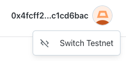

# Transactions dApp

[LIVE DEMO](https://dapp-transactions.vercel.app/)

Приложение работает идеально.

Отлавливает все ошибки.
Реактивно реагирует на изменения в MetaMask.

### Выполнил задание со звездочкой

Для того чтобы переключится на тестовые сети:

- войти с помощью MetaMask
- нажать на профиль
- найти кнопку "Switch Testnet"

### Модули

Для интеграции кошелька и работы с транзакциями использовал:

- metamask-react
- viem
- wagmi

#### Metamask React

Из этой библиотеки использовал status из хука useMetaMask.

Просмотрел все библиотеки metamask. Некторые из них перестают обновлять статус подключения при нескольких циклах входа/выхода кошелька. Некоторые - не отслеживают статус при мануальном подключении через само расширение MetaMask.
Так что, metamask-react работает лучше всех остальных.
На ее основе можно переписать свою.

#### Viem

Имеет список Mainnet и Testnet цепей с id, названием описанием валюты, rcpUrl, и прочей полезной информацией. Позволяет удобно расширять и настраивать список цепей через конфиг ./wagmi.config.ts
Кроме этого содержит базу, методы для работы с Etherium приложением, которую оборачивает Wagmi.

#### Wagmi

Обертка над Viem для разработки Etherium приложения.
Имеет core и react модуль с хуками.
Поддерживает React, Next.js, SSR.

### Почему не использовал официальный MetaMask SDK

Я решил следовать четко по ТЗ. В ТЗ указано, что
приложение должно подключаться именно к расширению.
MetaMask SDK же предлагает 2 варианта подключения.
С помощью расширения, либо с помощью мобильного приложения.
Во-первых, он странно работает. Когда расширение установлено, он не должен открывать окно подключения с выбором вариантов. И это работает через раз.
Во-вторых, Модуль SDK MetaMask имеет большой размер.
В-третьих, wagmi предоставляет возможность поддержки разных кошельков.
